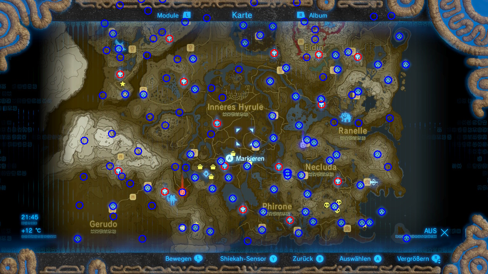

# Mark Shrine Locations
This script automatically marks shrine locations in your personal screenshots of Zelda: Breath of the Wild (Switch).

* It uses OpenCV to find tower symbols in the input image.
* Then, it tries to register a list of known tower locations into those and marks them in red (for reference).
* Finally, it applies to same transformation to all the shrine locations and marks them in blue.

For best results, try to have as many towers visible as possible.

Have Fun!
